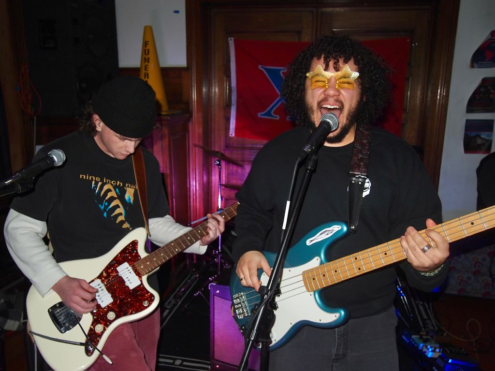

# Rembrandt Ryan 
## EE322 Repository
### Design VI
**Nothing Gold Can Stay**

> Nature’s first green is gold,
Her hardest hue to hold.
Her early leaf’s a flower;
But only so an hour.
Then leaf subsides to leaf.
So Eden sank to grief,
So dawn goes down to day.
Nothing gold can stay.

*Robert Frost*

### Stuff I Like
1. Music
2. Food
3. Movies

### Stuff I Hate
- Potholes
- Celery
- Country Music

`print("hello world");`

---

[Bread](https://www.youtube.com/watch?v=q3WC-X7xDNo)

